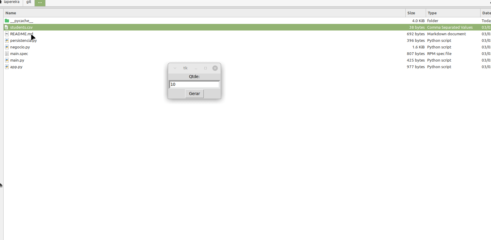

# Generate Evaluation Sheet To Students

Automate the creation of evaluation spreadsheets for students, simplifying grading and feedback.

---

## 🛠️ Main Features

- **Automatic evaluation spreadsheet generation**: Creates `.ods` files with student info and evaluation questions.
- **Graphical User Interface (GUI)**: Easy-to-use interface built with Tkinter.
- **Customizable number of questions**: Default is 2 questions per student; configurable via command line.

---

## 🔧 Technologies Used

- Python 3.6  
- Tkinter (GUI)  
- ezodf (for `.ods` spreadsheet manipulation)  

---

## 📁 Repository Structure

- `students.csv` — List of students to be evaluated  
- `planilha_avaliacao.ods` — Generated evaluation spreadsheet  
- `app.py` — Launches the GUI application  
- `main.py` — Runs the program in terminal mode  
- `negocio.py` — Business logic implementation  
- `persistencia.py` — Data persistence layer  
- `demo.gif` — Demonstration of the program in action  

---

## 🚀 How to Use

1. **Install dependencies**

   ```bash
   pip install ezodf
   sudo apt-get install python3-tk   # For Tkinter on Linux
``

2. **Run the program**

   * Terminal mode (default 2 questions):

     ```bash
     python3 main.py
     ```

   * Terminal mode with custom questions (e.g., 3 questions):

     ```bash
     python3 main.py 3
     ```

   * GUI mode:

     ```bash
     python3 app.py
     ```

3. **Prepare your students**

   Add student details to `students.csv` following the provided format.

4. **Generate the spreadsheet**

   Run the program to create a customized evaluation sheet for your students.

---

## 🎬 Demo



---

## ⚙️ Build Executable (Optional)

1. Install PyInstaller:

   ```bash
   pip3 install pyinstaller
   ```

2. Build executable:

   ```bash
   pyinstaller -D -F -n main -c "app.py"
   cd dist
   ./main
   ```

